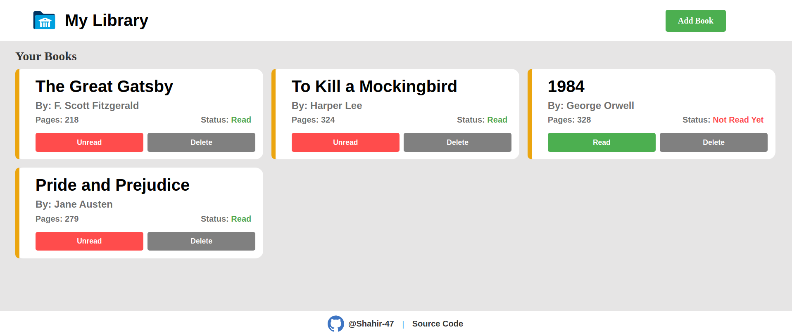

# myLibrary Project

myLibrary is a web application that allows users to create and manage their personal library. Users can add books to their library, specifying the book's title, author, number of pages, and whether they have read the book or not. The application provides a user-friendly interface for organizing and tracking books in the library.

## Features
- **Add books:** Users can add new books to their library by filling out a form with the book's details such as title, author, number of pages, and read status.
- **Display books:** The application dynamically displays the added books in a visually appealing way, showing the book's title, author, number of pages, and read status.
- **Update read status:** Users can toggle the read status of a book between "Read" and "Not Read Yet" by clicking on the corresponding button.
- **Delete books:** Users can remove books from their library by clicking on the delete button associated with each book.

## Technologies Used
- HTML: Markup language for creating the structure of the web page.
- CSS: Stylesheet language for styling the web page and creating a visually pleasing interface.
- JavaScript: Programming language used to add interactivity and functionality to the web page.

## Website
You can access the myLibrary online at: [https://shahir-47.github.io/Library/](https://shahir-47.github.io/Library/)

## Usage
1. Clone the repository: `git clone https://github.com/Shahir-47/myLibrary.git`
2. Navigate to the project directory: `cd myLibrary`
3. Open the `index.html` file in your preferred web browser.

## Screenshots

## Contributing
Contributions to myLibrary are welcome! If you find any issues or would like to add new features, please feel free to open an issue or submit a pull request.

## License
The project is licensed under the MIT License.

## Contact
For any questions or inquiries, please contact [ahmeds@dickinson.edu].

Enjoy organizing and managing your personal library with myLibrary!